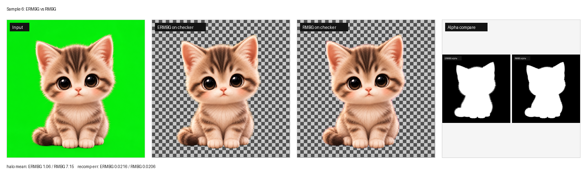
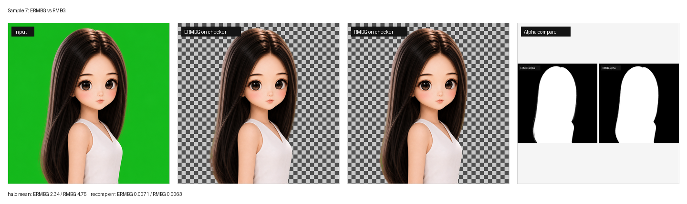
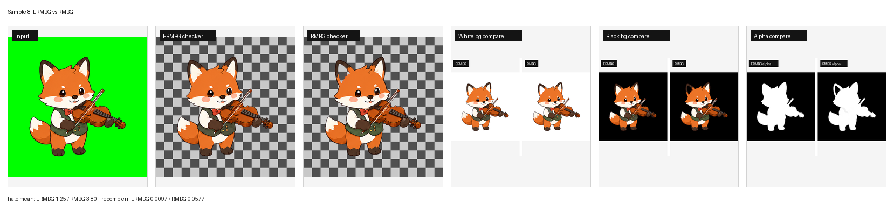
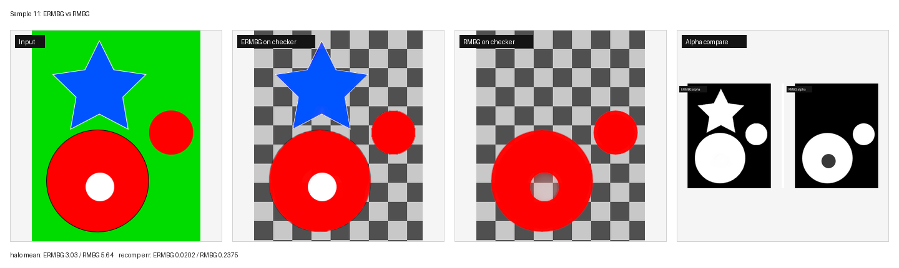

# ERMBG

> 给 AI 出图配套的智能抠图工具:
> **指定背景色出图 -> 自动选策略抠干净 -> 输出可直接复用的 RGBA**。

ERMBG 面向 AI 生成资产。只要生成阶段能指定已知、尽量恒定的背景色,
抠图就不再完全靠猜:系统可以利用观测颜色 `C`、已知背景 `B`、alpha
和 foreground recovery 模型做可验证的反演。

```text
AI image model  ->  known background image  ->  ERMBG  ->  RGBA asset
                      default: RGB(0,200,0)
```

目标很简单:用户给图,系统自己判断怎么抠。

## 关键特点

- **自动路由**:干净 RGBA、绿/品红/青等饱和底、白/黑/灰底、噪声底自动分流。
- **Known-B foreground recovery**:已知背景时用 linear-RGB unmix,不只靠经验 chroma 脚本。
- **RGBA hygiene check**:脏透明 PNG 的白边/黑边/旧背景泄漏/硬二值 alpha 会被识别并重抠。
- **CorridorKey game UI mainline**:游戏 UI 资产由 ERMBG router 先选最终
  execution profile,再走远端 `comfy-corridorkey` 或 `comfy-pymatting-known-b`。
  ERMBG 负责背景/色彩分析、参数适配、mask hint、ShadowPatch、QA 和回退。
- **Keyer + matting 融合**:补小漏检、守住 topology、修 hard edge、对同色歧义生成候选。
- **Local ownership 归属判断**:对 hole / soft subject / shadow-like layer 做本地多假设评分,
  默认走本地确定性证据。
- **Owned shadow 保留**:对符合 known-B scalar darkening 的源图阴影生成 shadow matte,
  强度由本地 CV 测量。
- **多背景 QA**:black / white / grey / cyan / magenta / checker,并带 lightwrap 变体。
- **多入口**:CLI、Python API、ComfyUI 节点、Web/API、OpenClaw skill。

## 安装

推荐 Python 3.12。Mac 上推荐 `uv`:

```bash
git clone <this-repo>
cd ERMBG
uv venv
source .venv/bin/activate
uv pip install -e ".[torch,dev]"
```

首次 BiRefNet 运行会下载约 1 GB 权重到 HuggingFace cache。

## 快速使用

```bash
# 端到端抠图,router 自动选策略
.venv/bin/ermbg matte input.png

# 只看诊断/router 决策
.venv/bin/ermbg diagnose input.png

# 批量
.venv/bin/ermbg phase1 --input-dir samples/legacy/inputs --out-dir out/phase1

# 可选 ownership mask,只作为约束,不直接替换最终 alpha
.venv/bin/ermbg matte input.png --subject-mask ownership_mask.png
```

输出:

```text
*_rgba.png
*_alpha.png
*_shadow.png
*_foreground.png
*_trimap.png
*.report.json
*_qa/on_*.png
```

## Local Ownership

当前方向是 Local Ownership:默认用本地证据做 region ownership 判断。旧的模型规划路线已经归档,
不再作为工程主路径。

```text
known background image
  -> local matte
  -> local evidence regions
  -> local multi-hypothesis ownership scoring
  -> execution-mask arbitration
  -> protected matte only when soft subject material needs protection
```

当前角色:

- `hole`:透明洞/背景区域,保持低 alpha。
- `opaque_subject`:硬主体漏检,允许受保护的 alpha repair。
- `subject_soft_layer`:玻璃、辉光、烟雾、柔边或半透明主体层,保护 soft alpha。
- `shadow_like_layer`:已知背景的 scalar darkening,走 shadow matte。
- `conservative_unknown`:证据不足,保留当前 alpha。

当前全量样本集已经收口到 `samples/corridorkey_semantic/`:

```bash
.venv/bin/python scripts/run_corridorkey_game_eval.py \
  --backend comfy-corridorkey
```

样本规模:

- Button:56
- Icon / effect:20
- Character:9 (1024x1024)

第一阶段样本建设已完成。第二阶段目标是基于这 85 个确认样本做识别/路由审计,
再进入路径内参数调优。详情见
[docs/corridorkey-semantic-paths.md](docs/corridorkey-semantic-paths.md)。

## Python API

```python
from ermbg import classify_image, matte_image

r = matte_image("input.png", output_dir="out/", qa=True)

r.rgba
r.strategy_name
r.report["qa"]["edge_halo_score_mean"]

s = classify_image("input.png")
print(s.bg_type, s.image_type, s.notes)
```

输入支持 path、`numpy uint8` (`HxWx3` / `HxWx4`) 或 PIL Image。
完整示例见 [examples/quickstart.py](examples/quickstart.py)。

## ComfyUI

ComfyUI HTTP address is local configuration. Set `COMFY_URL` in your shell or
in the gitignored local `.env` file, for example:

```bash
COMFY_URL=http://127.0.0.1:8000
```

If `COMFY_URL` is not configured, ERMBG falls back to the historical LAN server
address used by this repository.

当前游戏 UI 资产自动路径统一由 ERMBG route strategy 决定:硬边按钮走
**`comfy-pymatting-known-b`**,绿/蓝底 icon、character、玻璃/半透明按钮走
**`comfy-corridorkey` + ShadowPatch**,未知/不稳定背景也走
**`comfy-pymatting-known-b` PyMatting fallback**。
Router 会在执行前写入最终 `execution_profile`,例如
`pymatting-hard-button`、`corridorkey-transparent-button`、
`corridorkey-character`、`corridorkey-effect-icon` 或
`corridorkey-shaped-icon`。执行层只消费这个 profile 和随附参数,不再根据
CorridorKey 的语义分析二次猜测路径。
Web/API 的 `backend="auto"` 现在提交单个 **ERMBG Route Matte** Comfy 节点;
Mac 侧只负责上传输入、提交 workflow、轮询和拉取结果图/metadata。背景/色彩
分析、参数适配、CorridorKey hint、ShadowPatch 和 PyMatting fallback 均在 Comfy 端运行。

实验路径 `backend="direct-worker"` 仍使用同一套 router、`parameter_profile`
和 `execution_profile`,但通过远端 `ermbg.direct_worker_server` 直接执行
PyMatting Known-B 或 CorridorKey,绕过 ComfyUI prompt/queue。Direct Worker
不是第二套路由或 CorridorKey 实现:Comfy 节点和 Direct Worker 都调用
`ermbg.corridorkey_runner.LocalCorridorKeyClient`,确保 hint 转换、参数、模型
调用和 color protection 只维护一份。对比 Direct 与 `backend="auto"` 时,
应以同样本的 profile、hint source 和 alpha/RGBA 差异为准;明显差异通常说明
执行层分叉,而不是 profile 本身不同。

后续 Web/API 行为更新不能只以本地 Python 跑通为准,必须同步验证远端节点和 Web API。

`comfy_nodes/` 提供:

- **ERMBG Route Strategy**:在 Comfy 进程内运行同一套 auto 路由策略。
- **ERMBG Route Matte**:生产 auto 节点,在 Comfy 进程内完成路由和具体抠图。
- **ERMBG PyMatting Known-B**:已知背景硬边按钮路径。
- **ERMBG Classify (preview)**:只跑 router,用于工作流分支。

最简工作流:

```text
KSampler -> VAEDecode -> ERMBG Route Matte -> foreground/alpha/rgba_rgb
```

开发/迭代验证流程见 [docs/ermbg-route-strategy.md](docs/ermbg-route-strategy.md)。
节点部署见 [comfy_nodes/README.md](comfy_nodes/README.md) 和 [DEPLOY.md](DEPLOY.md)。

## OpenClaw

ERMBG 已合入 OpenClaw 的 `comfyui-rmbg` skill,作为 `--mode ermbg` 子模式。
触发词如 **智能抠图 / AI生图抠图 / smart matte / ERMBG** 走 ERMBG 路径;
普通“抠图 / 去背景”仍可走标准 RMBG。

详见 [integrations/openclaw/README.md](integrations/openclaw/README.md)。

## 示例效果

下面四组图来自 legacy samples,对比 ERMBG 和 RMBG baseline。每组包含原图、
checker 合成、白/黑底对比和 alpha 对比。









| 输入 | ERMBG halo mean | RMBG halo mean | ERMBG recomp err | RMBG recomp err |
|---|---:|---:|---:|---:|
| 6 | 1.06 | 7.15 | 0.0216 | 0.0206 |
| 7 | 2.34 | 4.75 | 0.0071 | 0.0063 |
| 8 | 1.25 | 3.80 | 0.0097 | 0.0577 |
| 11 | 3.03 | 5.64 | 0.0202 | 0.2375 |

指标来自各自 `report.json`;ERMBG 和 RMBG baseline 使用同一套 QA 评分。

## 测试

```bash
# 日常重点回归
.venv/bin/pytest -q -m core

# 提交/接力前全量
.venv/bin/pytest -q

# Local ownership / shadow 专项
.venv/bin/pytest tests/test_ownership.py tests/test_shadow.py tests/test_risk.py -q

# Comfy/Web 正式路径相关变更
.venv/bin/pytest tests/test_api.py tests/test_comfy_ermbg_matte.py tests/test_comfy_nodes.py tests/test_web.py -q
```

全量测试数量会随当前分支变化;接力前以本地 `.venv/bin/pytest -q` 为准。

当前主回归入口是 `samples/corridorkey_semantic/manifest.json`。真实用户
回归以后仍放入 `samples/regression/`，但不要引用已退役的旧样本目录；新增
case 需要带 `case.json` 并说明它覆盖的失败机制。

## 文档索引

- [docs/corridorkey-game-ui-plan.md](docs/corridorkey-game-ui-plan.md):
  当前开发主线:CorridorKey 游戏 UI 工作流、自动参数适配、蓝底路线和 Web mask 兜底。
- [docs/local-ownership.md](docs/local-ownership.md):
  local ownership、执行层仲裁和当前复现命令。
- [docs/ermbg-route-strategy.md](docs/ermbg-route-strategy.md):
  ERMBG auto 路由策略、Comfy 节点和 Web smoke 验证流程。
- [docs/corridorkey-semantic-paths.md](docs/corridorkey-semantic-paths.md):
  当前全量测试样本、阶段状态和下一阶段路线。
- [docs/archive/](docs/archive/):
  旧模型规划、candidate-planner、G-style 单样本路线归档,只作历史参考。
- [DEPLOY.md](DEPLOY.md):ComfyUI 部署。
- [comfy_nodes/README.md](comfy_nodes/README.md):ComfyUI 节点用法。

## 开发反馈

提 issue 时请附上:

- 输入图;
- `*.report.json`;
- 能看清 artifact 的 `*_qa/on_black.png` 或其他合成图;
- 预期语义,尤其是同色区域应当是主体材质、透明洞,还是 owned shadow。
