# ERMBG 全量样本结果 Gallery

来源 batch: `out/direct_worker_game_input_20260610_v002`。后端: `direct-worker`。结果: `88/88` ok。覆盖: button 57 / character 9 / icon 22。

每张缩略图是对应 case 的 contact sheet，用于快速检查 input、RGBA、alpha、trimap 等输出。原始 batch 仍保留在 `out/`，文档中只提交压缩后的展示图。

## 汇总

| 项 | 值 |
| --- | --- |
| Batch | `out/direct_worker_game_input_20260610_v002` |
| Backend | `direct-worker` |
| Cases | `88/88` ok |
| Artifact manifest | `out/direct_worker_game_input_20260610_v002/manifest.json` |

## Button (57)

<table>
<tr>
<td width="33%" valign="top"><a href="#b001" title="B001 · button · pymatting-hard-button">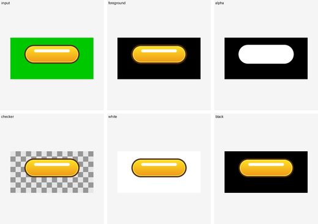</a> <b>B001</b> · ok pymatting-hard-button pymatting_known_b</td>
<td width="33%" valign="top"> <b>B002</b> · ok pymatting-hard-button pymatting_known_b</td>
<td width="33%" valign="top"> <b>B003</b> · ok pymatting-hard-button pymatting_known_b</td>
</tr>
<tr>
<td width="33%" valign="top"> <b>B004</b> · ok pymatting-hard-button pymatting_known_b</td>
<td width="33%" valign="top"><a href="#b005" title="B005 · button · pymatting-hard-button">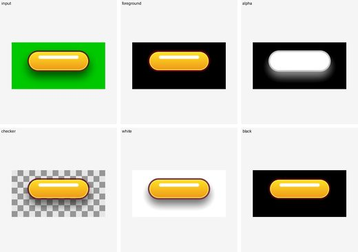</a> <b>B005</b> · ok pymatting-hard-button pymatting_known_b</td>
<td width="33%" valign="top"><a href="#b006" title="B006 · button · pymatting-hard-button">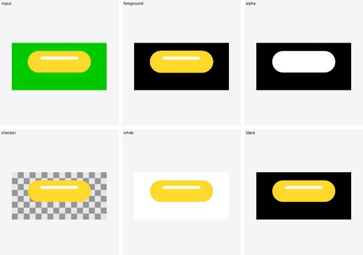</a> <b>B006</b> · ok pymatting-hard-button pymatting_known_b</td>
</tr>
<tr>
<td width="33%" valign="top"><a href="#b007" title="B007 · button · pymatting-hard-button">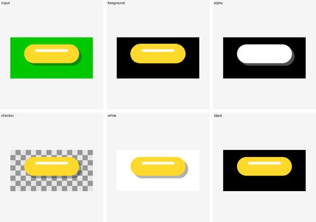</a> <b>B007</b> · ok pymatting-hard-button pymatting_known_b</td>
<td width="33%" valign="top"> <b>B008</b> · ok pymatting-hard-button pymatting_known_b</td>
<td width="33%" valign="top"><a href="#b009" title="B009 · button · pymatting-hard-button">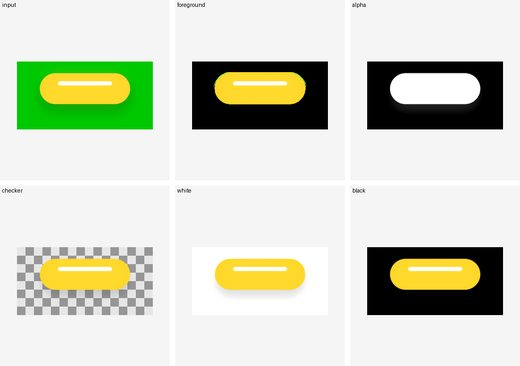</a> <b>B009</b> · ok pymatting-hard-button pymatting_known_b</td>
</tr>
<tr>
<td width="33%" valign="top"><a href="#b010" title="B010 · button · pymatting-hard-button">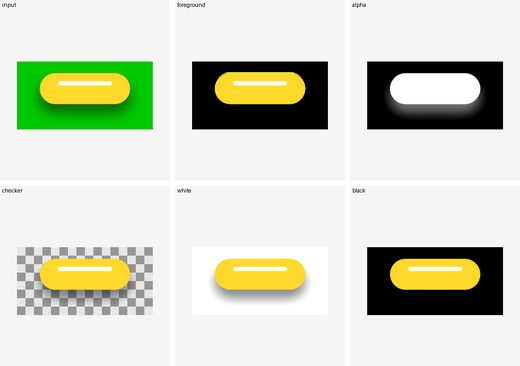</a> <b>B010</b> · ok pymatting-hard-button pymatting_known_b</td>
<td width="33%" valign="top"><a href="#b011" title="B011 · button · corridorkey-transparent-button">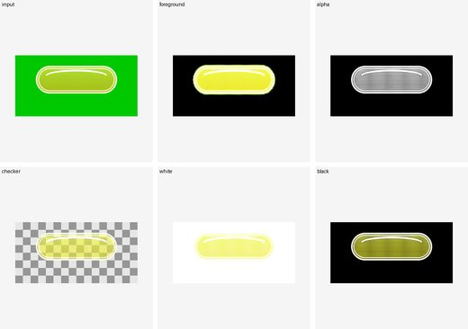</a> <b>B011</b> · ok corridorkey-transparent-button corridorkey</td>
<td width="33%" valign="top"><a href="#b012" title="B012 · button · corridorkey-transparent-button">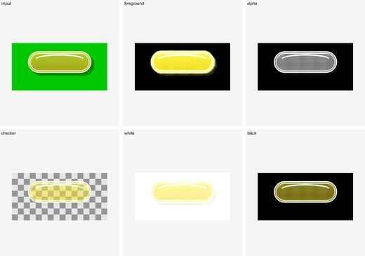</a> <b>B012</b> · ok corridorkey-transparent-button corridorkey</td>
</tr>
<tr>
<td width="33%" valign="top"><a href="#b013" title="B013 · button · corridorkey-transparent-button">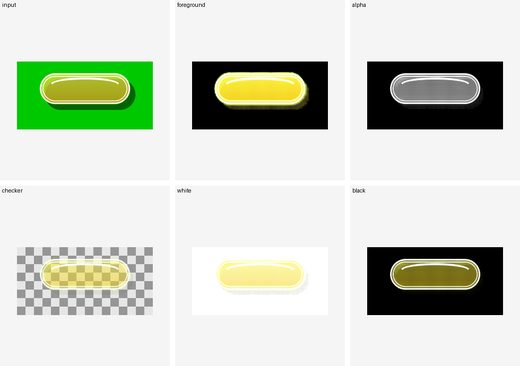</a> <b>B013</b> · ok corridorkey-transparent-button corridorkey</td>
<td width="33%" valign="top"> <b>B014</b> · ok corridorkey-transparent-button corridorkey</td>
<td width="33%" valign="top"> <b>B015</b> · ok corridorkey-transparent-button corridorkey</td>
</tr>
<tr>
<td width="33%" valign="top"><a href="#b016" title="B016 · button · pymatting-hard-button">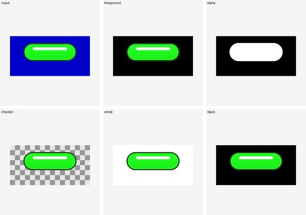</a> <b>B016</b> · ok pymatting-hard-button pymatting_known_b</td>
<td width="33%" valign="top"> <b>B017</b> · ok pymatting-hard-button pymatting_known_b</td>
<td width="33%" valign="top"><a href="#b018" title="B018 · button · pymatting-hard-button">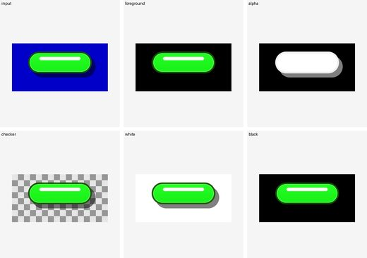</a> <b>B018</b> · ok pymatting-hard-button pymatting_known_b</td>
</tr>
<tr>
<td width="33%" valign="top"> <b>B019</b> · ok pymatting-hard-button pymatting_known_b</td>
<td width="33%" valign="top"><a href="#b020" title="B020 · button · pymatting-hard-button">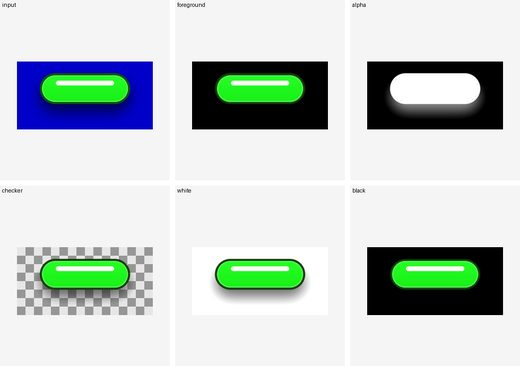</a> <b>B020</b> · ok pymatting-hard-button pymatting_known_b</td>
<td width="33%" valign="top"><a href="#b021" title="B021 · button · pymatting-hard-button">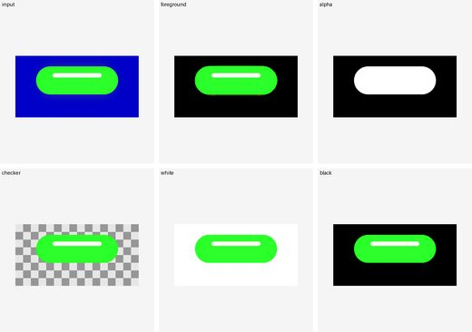</a> <b>B021</b> · ok pymatting-hard-button pymatting_known_b</td>
</tr>
<tr>
<td width="33%" valign="top"><a href="#b022" title="B022 · button · pymatting-hard-button">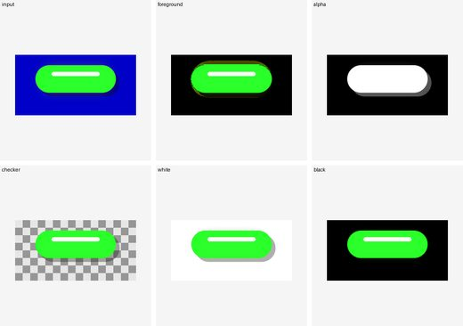</a> <b>B022</b> · ok pymatting-hard-button pymatting_known_b</td>
<td width="33%" valign="top"><a href="#b023" title="B023 · button · pymatting-hard-button">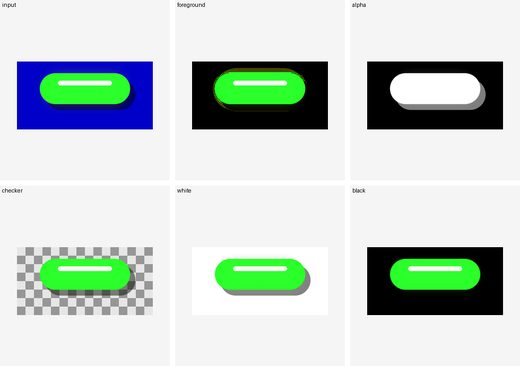</a> <b>B023</b> · ok pymatting-hard-button pymatting_known_b</td>
<td width="33%" valign="top"><a href="#b024" title="B024 · button · pymatting-hard-button">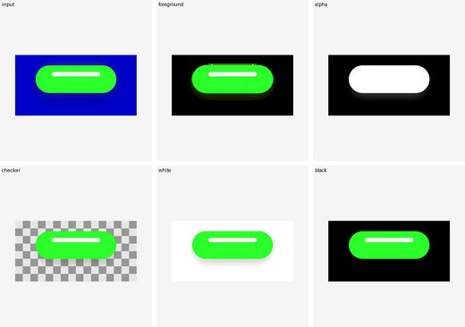</a> <b>B024</b> · ok pymatting-hard-button pymatting_known_b</td>
</tr>
<tr>
<td width="33%" valign="top"><a href="#b025" title="B025 · button · pymatting-hard-button">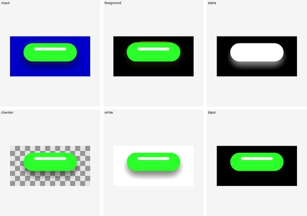</a> <b>B025</b> · ok pymatting-hard-button pymatting_known_b</td>
<td width="33%" valign="top"><a href="#b026" title="B026 · button · pymatting-hard-button">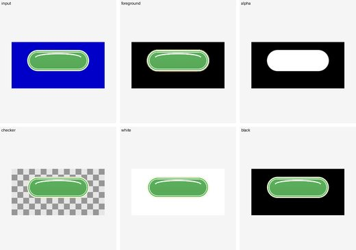</a> <b>B026</b> · ok pymatting-hard-button pymatting_known_b</td>
<td width="33%" valign="top"><a href="#b027" title="B027 · button · corridorkey-transparent-button">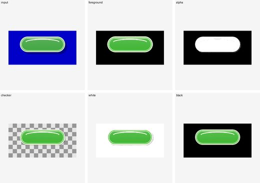</a> <b>B027</b> · ok corridorkey-transparent-button corridorkey</td>
</tr>
<tr>
<td width="33%" valign="top"><a href="#b028" title="B028 · button · pymatting-hard-button">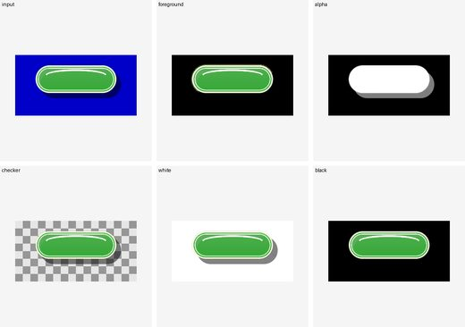</a> <b>B028</b> · ok pymatting-hard-button pymatting_known_b</td>
<td width="33%" valign="top"><a href="#b029" title="B029 · button · pymatting-hard-button">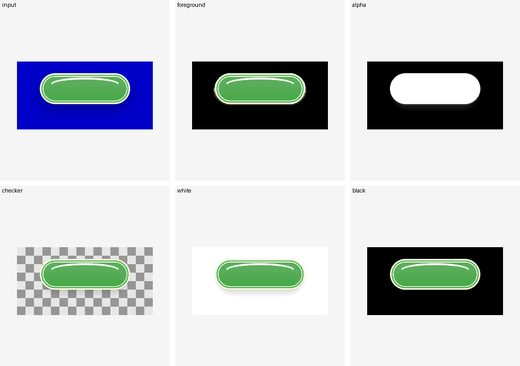</a> <b>B029</b> · ok pymatting-hard-button pymatting_known_b</td>
<td width="33%" valign="top"><a href="#b030" title="B030 · button · corridorkey-transparent-button">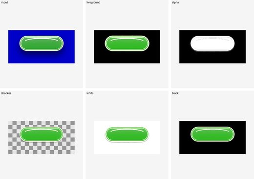</a> <b>B030</b> · ok corridorkey-transparent-button corridorkey</td>
</tr>
<tr>
<td width="33%" valign="top"> <b>B031</b> · ok pymatting-hard-button pymatting_known_b</td>
<td width="33%" valign="top"><a href="#b032" title="B032 · button · pymatting-hard-button">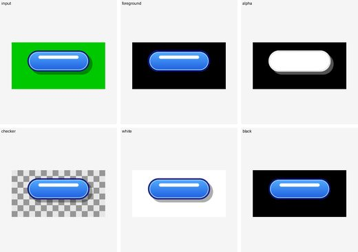</a> <b>B032</b> · ok pymatting-hard-button pymatting_known_b</td>
<td width="33%" valign="top"> <b>B033</b> · ok pymatting-hard-button pymatting_known_b</td>
</tr>
<tr>
<td width="33%" valign="top"> <b>B034</b> · ok pymatting-hard-button pymatting_known_b</td>
<td width="33%" valign="top"><a href="#b035" title="B035 · button · pymatting-hard-button">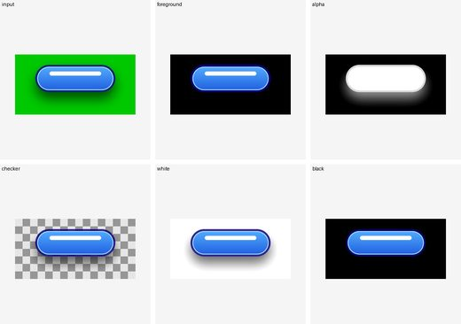</a> <b>B035</b> · ok pymatting-hard-button pymatting_known_b</td>
<td width="33%" valign="top"> <b>B036</b> · ok pymatting-hard-button pymatting_known_b</td>
</tr>
<tr>
<td width="33%" valign="top"><a href="#b037" title="B037 · button · pymatting-hard-button">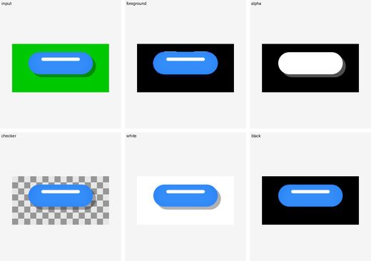</a> <b>B037</b> · ok pymatting-hard-button pymatting_known_b</td>
<td width="33%" valign="top"><a href="#b038" title="B038 · button · pymatting-hard-button">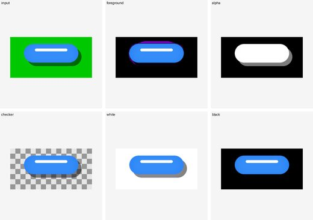</a> <b>B038</b> · ok pymatting-hard-button pymatting_known_b</td>
<td width="33%" valign="top"><a href="#b039" title="B039 · button · pymatting-hard-button">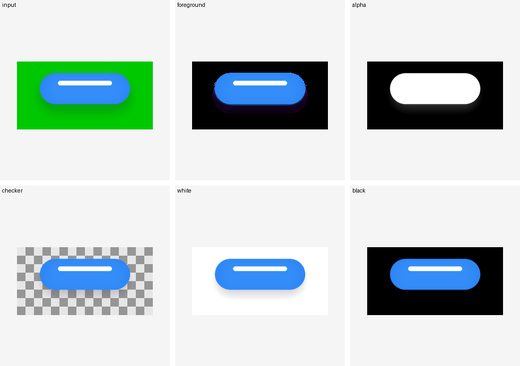</a> <b>B039</b> · ok pymatting-hard-button pymatting_known_b</td>
</tr>
<tr>
<td width="33%" valign="top"><a href="#b040" title="B040 · button · pymatting-hard-button">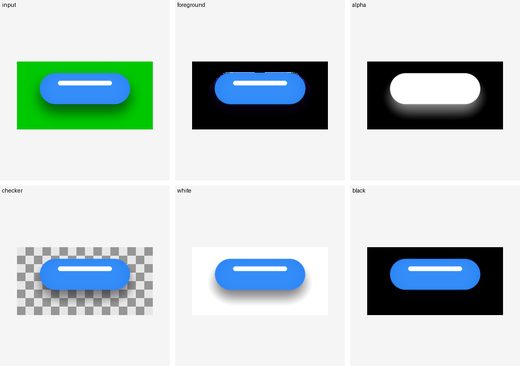</a> <b>B040</b> · ok pymatting-hard-button pymatting_known_b</td>
<td width="33%" valign="top"><a href="#b041" title="B041 · button · pymatting-hard-button">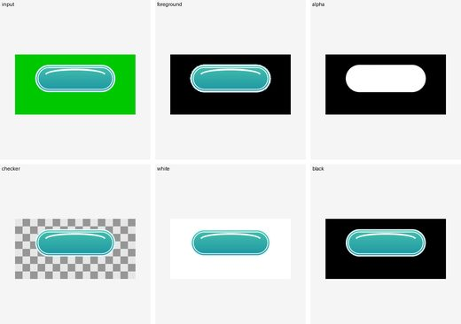</a> <b>B041</b> · ok pymatting-hard-button pymatting_known_b</td>
<td width="33%" valign="top"> <b>B042</b> · ok pymatting-hard-button pymatting_known_b</td>
</tr>
<tr>
<td width="33%" valign="top"> <b>B043</b> · ok pymatting-hard-button pymatting_known_b</td>
<td width="33%" valign="top"><a href="#b044" title="B044 · button · corridorkey-transparent-button">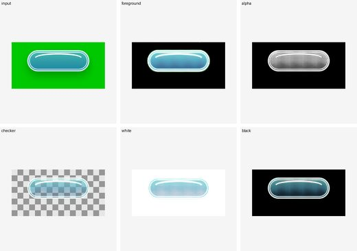</a> <b>B044</b> · ok corridorkey-transparent-button corridorkey</td>
<td width="33%" valign="top"> <b>B045</b> · ok pymatting-hard-button pymatting_known_b</td>
</tr>
<tr>
<td width="33%" valign="top"><a href="#b046" title="B046 · button · corridorkey-transparent-button">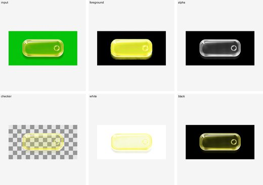</a> <b>B046</b> · ok corridorkey-transparent-button corridorkey</td>
<td width="33%" valign="top"><a href="#b047" title="B047 · button · corridorkey-transparent-button">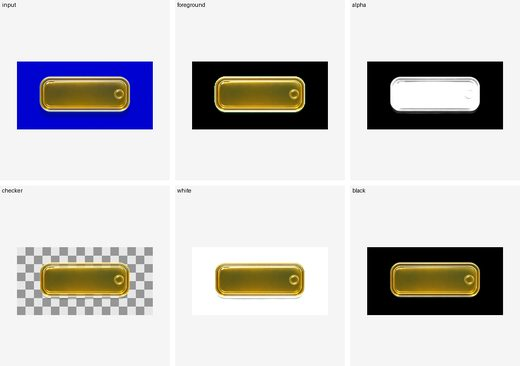</a> <b>B047</b> · ok corridorkey-transparent-button corridorkey</td>
<td width="33%" valign="top"><a href="#b048" title="B048 · button · corridorkey-transparent-button">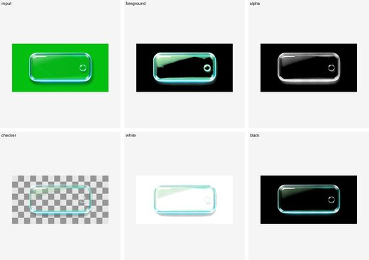</a> <b>B048</b> · ok corridorkey-transparent-button corridorkey</td>
</tr>
<tr>
<td width="33%" valign="top"><a href="#b049" title="B049 · button · corridorkey-transparent-button">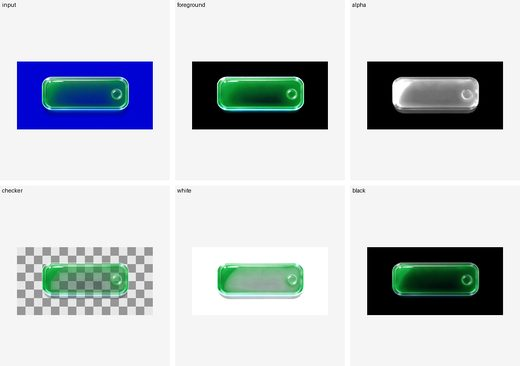</a> <b>B049</b> · ok corridorkey-transparent-button corridorkey</td>
<td width="33%" valign="top"><a href="#b050" title="B050 · button · pymatting-hard-button">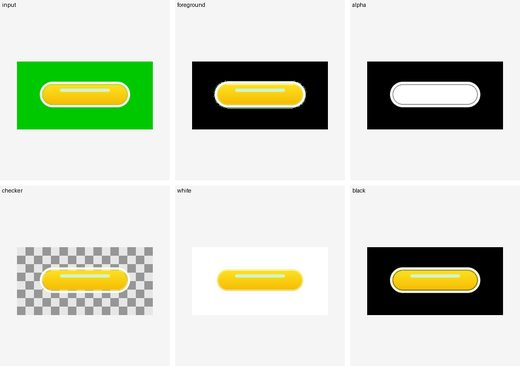</a> <b>B050</b> · ok pymatting-hard-button pymatting_known_b</td>
<td width="33%" valign="top"><a href="#b051" title="B051 · button · pymatting-hard-button">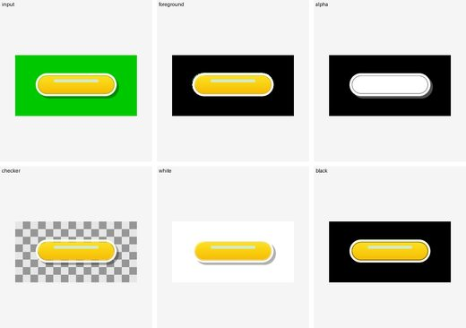</a> <b>B051</b> · ok pymatting-hard-button pymatting_known_b</td>
</tr>
<tr>
<td width="33%" valign="top"><a href="#b052" title="B052 · button · pymatting-hard-button">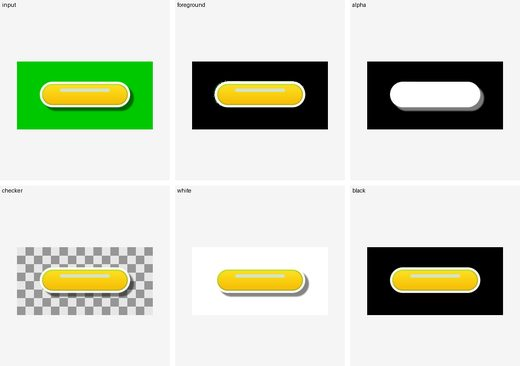</a> <b>B052</b> · ok pymatting-hard-button pymatting_known_b</td>
<td width="33%" valign="top"><a href="#b053" title="B053 · button · pymatting-hard-button">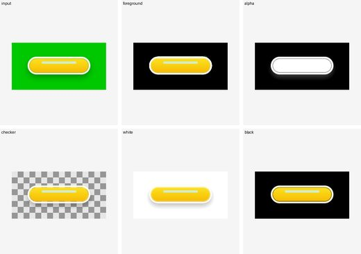</a> <b>B053</b> · ok pymatting-hard-button pymatting_known_b</td>
<td width="33%" valign="top"><a href="#b054" title="B054 · button · pymatting-hard-button">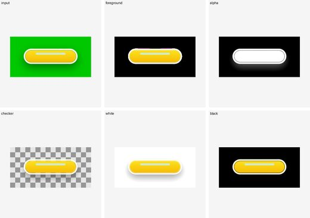</a> <b>B054</b> · ok pymatting-hard-button pymatting_known_b</td>
</tr>
<tr>
<td width="33%" valign="top"><a href="#b055" title="B055 · button · pymatting-hard-button">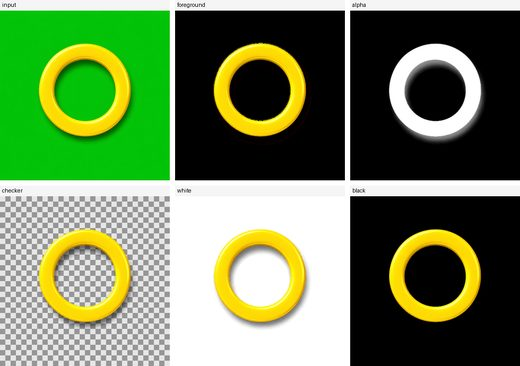</a> <b>B055</b> · ok pymatting-hard-button pymatting_known_b</td>
<td width="33%" valign="top"><a href="#b056" title="B056 · button · pymatting-hard-button">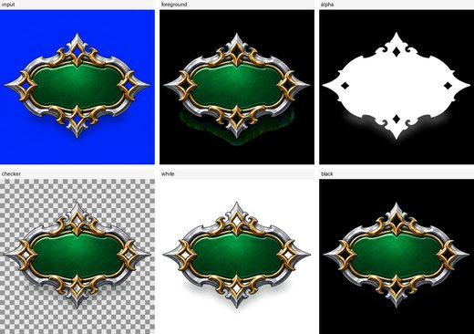</a> <b>B056</b> · ok pymatting-hard-button pymatting_known_b</td>
<td width="33%" valign="top"><a href="#b057" title="B057 · button · pymatting-hard-button">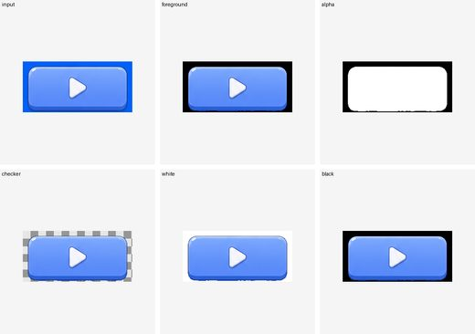</a> <b>B057</b> · ok pymatting-hard-button pymatting_known_b</td>
</tr>
</table>

### B001

- Case: `B001_button_green_yellow_a_outlined_no_shadow_green`
- Status: `ok`
- Profile: `pymatting-hard-button`
- Algorithm: `pymatting_known_b`
- Execution backend: `direct-pymatting-known-b`
- Input: `samples/corridorkey_semantic/button/button_green_yellow_a_outlined_no_shadow/green.png`
- Manifest: `out/direct_worker_game_input_20260610_v002/B001_button_green_yellow_a_outlined_no_shadow_green/manifest.json`

### B002

- Case: `B002_button_green_yellow_a_outlined_hard_lite_shadow_green`
- Status: `ok`
- Profile: `pymatting-hard-button`
- Algorithm: `pymatting_known_b`
- Execution backend: `direct-pymatting-known-b`
- Input: `samples/corridorkey_semantic/button/button_green_yellow_a_outlined_hard_lite_shadow/green.png`
- Manifest: `out/direct_worker_game_input_20260610_v002/B002_button_green_yellow_a_outlined_hard_lite_shadow_green/manifest.json`

### B003

- Case: `B003_button_green_yellow_a_outlined_hard_heavy_shadow_green`
- Status: `ok`
- Profile: `pymatting-hard-button`
- Algorithm: `pymatting_known_b`
- Execution backend: `direct-pymatting-known-b`
- Input: `samples/corridorkey_semantic/button/button_green_yellow_a_outlined_hard_heavy_shadow/green.png`
- Manifest: `out/direct_worker_game_input_20260610_v002/B003_button_green_yellow_a_outlined_hard_heavy_shadow_green/manifest.json`

### B004

- Case: `B004_button_green_yellow_a_outlined_soft_lite_shadow_green`
- Status: `ok`
- Profile: `pymatting-hard-button`
- Algorithm: `pymatting_known_b`
- Execution backend: `direct-pymatting-known-b`
- Input: `samples/corridorkey_semantic/button/button_green_yellow_a_outlined_soft_lite_shadow/green.png`
- Manifest: `out/direct_worker_game_input_20260610_v002/B004_button_green_yellow_a_outlined_soft_lite_shadow_green/manifest.json`

### B005

- Case: `B005_button_green_yellow_a_outlined_soft_heavy_shadow_green`
- Status: `ok`
- Profile: `pymatting-hard-button`
- Algorithm: `pymatting_known_b`
- Execution backend: `direct-pymatting-known-b`
- Input: `samples/corridorkey_semantic/button/button_green_yellow_a_outlined_soft_heavy_shadow/green.png`
- Manifest: `out/direct_worker_game_input_20260610_v002/B005_button_green_yellow_a_outlined_soft_heavy_shadow_green/manifest.json`

### B006

- Case: `B006_button_green_yellow_b_unoutlined_no_shadow_green`
- Status: `ok`
- Profile: `pymatting-hard-button`
- Algorithm: `pymatting_known_b`
- Execution backend: `direct-pymatting-known-b`
- Input: `samples/corridorkey_semantic/button/button_green_yellow_b_unoutlined_no_shadow/green.png`
- Manifest: `out/direct_worker_game_input_20260610_v002/B006_button_green_yellow_b_unoutlined_no_shadow_green/manifest.json`

### B007

- Case: `B007_button_green_yellow_b_unoutlined_hard_lite_shadow_green`
- Status: `ok`
- Profile: `pymatting-hard-button`
- Algorithm: `pymatting_known_b`
- Execution backend: `direct-pymatting-known-b`
- Input: `samples/corridorkey_semantic/button/button_green_yellow_b_unoutlined_hard_lite_shadow/green.png`
- Manifest: `out/direct_worker_game_input_20260610_v002/B007_button_green_yellow_b_unoutlined_hard_lite_shadow_green/manifest.json`

### B008

- Case: `B008_button_green_yellow_b_unoutlined_hard_heavy_shadow_green`
- Status: `ok`
- Profile: `pymatting-hard-button`
- Algorithm: `pymatting_known_b`
- Execution backend: `direct-pymatting-known-b`
- Input: `samples/corridorkey_semantic/button/button_green_yellow_b_unoutlined_hard_heavy_shadow/green.png`
- Manifest: `out/direct_worker_game_input_20260610_v002/B008_button_green_yellow_b_unoutlined_hard_heavy_shadow_green/manifest.json`

### B009

- Case: `B009_button_green_yellow_b_unoutlined_soft_lite_shadow_green`
- Status: `ok`
- Profile: `pymatting-hard-button`
- Algorithm: `pymatting_known_b`
- Execution backend: `direct-pymatting-known-b`
- Input: `samples/corridorkey_semantic/button/button_green_yellow_b_unoutlined_soft_lite_shadow/green.png`
- Manifest: `out/direct_worker_game_input_20260610_v002/B009_button_green_yellow_b_unoutlined_soft_lite_shadow_green/manifest.json`

### B010

- Case: `B010_button_green_yellow_b_unoutlined_soft_heavy_shadow_green`
- Status: `ok`
- Profile: `pymatting-hard-button`
- Algorithm: `pymatting_known_b`
- Execution backend: `direct-pymatting-known-b`
- Input: `samples/corridorkey_semantic/button/button_green_yellow_b_unoutlined_soft_heavy_shadow/green.png`
- Manifest: `out/direct_worker_game_input_20260610_v002/B010_button_green_yellow_b_unoutlined_soft_heavy_shadow_green/manifest.json`

### B011

- Case: `B011_button_green_yellow_c_translucent_no_shadow_green`
- Status: `ok`
- Profile: `corridorkey-transparent-button`
- Algorithm: `corridorkey`
- Execution backend: `direct-corridorkey`
- Input: `samples/corridorkey_semantic/button/button_green_yellow_c_translucent_no_shadow/green.png`
- Manifest: `out/direct_worker_game_input_20260610_v002/B011_button_green_yellow_c_translucent_no_shadow_green/manifest.json`

### B012

- Case: `B012_button_green_yellow_c_translucent_hard_lite_shadow_green`
- Status: `ok`
- Profile: `corridorkey-transparent-button`
- Algorithm: `corridorkey`
- Execution backend: `direct-corridorkey`
- Input: `samples/corridorkey_semantic/button/button_green_yellow_c_translucent_hard_lite_shadow/green.png`
- Manifest: `out/direct_worker_game_input_20260610_v002/B012_button_green_yellow_c_translucent_hard_lite_shadow_green/manifest.json`

### B013

- Case: `B013_button_green_yellow_c_translucent_hard_heavy_shadow_green`
- Status: `ok`
- Profile: `corridorkey-transparent-button`
- Algorithm: `corridorkey`
- Execution backend: `direct-corridorkey`
- Input: `samples/corridorkey_semantic/button/button_green_yellow_c_translucent_hard_heavy_shadow/green.png`
- Manifest: `out/direct_worker_game_input_20260610_v002/B013_button_green_yellow_c_translucent_hard_heavy_shadow_green/manifest.json`

### B014

- Case: `B014_button_green_yellow_c_translucent_soft_lite_shadow_green`
- Status: `ok`
- Profile: `corridorkey-transparent-button`
- Algorithm: `corridorkey`
- Execution backend: `direct-corridorkey`
- Input: `samples/corridorkey_semantic/button/button_green_yellow_c_translucent_soft_lite_shadow/green.png`
- Manifest: `out/direct_worker_game_input_20260610_v002/B014_button_green_yellow_c_translucent_soft_lite_shadow_green/manifest.json`

### B015

- Case: `B015_button_green_yellow_c_translucent_soft_heavy_shadow_green`
- Status: `ok`
- Profile: `corridorkey-transparent-button`
- Algorithm: `corridorkey`
- Execution backend: `direct-corridorkey`
- Input: `samples/corridorkey_semantic/button/button_green_yellow_c_translucent_soft_heavy_shadow/green.png`
- Manifest: `out/direct_worker_game_input_20260610_v002/B015_button_green_yellow_c_translucent_soft_heavy_shadow_green/manifest.json`

### B016

- Case: `B016_button_blue_green_a_outlined_no_shadow_blue`
- Status: `ok`
- Profile: `pymatting-hard-button`
- Algorithm: `pymatting_known_b`
- Execution backend: `direct-pymatting-known-b`
- Input: `samples/corridorkey_semantic/button/button_blue_green_a_outlined_no_shadow/blue.png`
- Manifest: `out/direct_worker_game_input_20260610_v002/B016_button_blue_green_a_outlined_no_shadow_blue/manifest.json`

### B017

- Case: `B017_button_blue_green_a_outlined_hard_lite_shadow_blue`
- Status: `ok`
- Profile: `pymatting-hard-button`
- Algorithm: `pymatting_known_b`
- Execution backend: `direct-pymatting-known-b`
- Input: `samples/corridorkey_semantic/button/button_blue_green_a_outlined_hard_lite_shadow/blue.png`
- Manifest: `out/direct_worker_game_input_20260610_v002/B017_button_blue_green_a_outlined_hard_lite_shadow_blue/manifest.json`

### B018

- Case: `B018_button_blue_green_a_outlined_hard_heavy_shadow_blue`
- Status: `ok`
- Profile: `pymatting-hard-button`
- Algorithm: `pymatting_known_b`
- Execution backend: `direct-pymatting-known-b`
- Input: `samples/corridorkey_semantic/button/button_blue_green_a_outlined_hard_heavy_shadow/blue.png`
- Manifest: `out/direct_worker_game_input_20260610_v002/B018_button_blue_green_a_outlined_hard_heavy_shadow_blue/manifest.json`

### B019

- Case: `B019_button_blue_green_a_outlined_soft_lite_shadow_blue`
- Status: `ok`
- Profile: `pymatting-hard-button`
- Algorithm: `pymatting_known_b`
- Execution backend: `direct-pymatting-known-b`
- Input: `samples/corridorkey_semantic/button/button_blue_green_a_outlined_soft_lite_shadow/blue.png`
- Manifest: `out/direct_worker_game_input_20260610_v002/B019_button_blue_green_a_outlined_soft_lite_shadow_blue/manifest.json`

### B020

- Case: `B020_button_blue_green_a_outlined_soft_heavy_shadow_blue`
- Status: `ok`
- Profile: `pymatting-hard-button`
- Algorithm: `pymatting_known_b`
- Execution backend: `direct-pymatting-known-b`
- Input: `samples/corridorkey_semantic/button/button_blue_green_a_outlined_soft_heavy_shadow/blue.png`
- Manifest: `out/direct_worker_game_input_20260610_v002/B020_button_blue_green_a_outlined_soft_heavy_shadow_blue/manifest.json`

### B021

- Case: `B021_button_blue_green_b_unoutlined_no_shadow_blue`
- Status: `ok`
- Profile: `pymatting-hard-button`
- Algorithm: `pymatting_known_b`
- Execution backend: `direct-pymatting-known-b`
- Input: `samples/corridorkey_semantic/button/button_blue_green_b_unoutlined_no_shadow/blue.png`
- Manifest: `out/direct_worker_game_input_20260610_v002/B021_button_blue_green_b_unoutlined_no_shadow_blue/manifest.json`

### B022

- Case: `B022_button_blue_green_b_unoutlined_hard_lite_shadow_blue`
- Status: `ok`
- Profile: `pymatting-hard-button`
- Algorithm: `pymatting_known_b`
- Execution backend: `direct-pymatting-known-b`
- Input: `samples/corridorkey_semantic/button/button_blue_green_b_unoutlined_hard_lite_shadow/blue.png`
- Manifest: `out/direct_worker_game_input_20260610_v002/B022_button_blue_green_b_unoutlined_hard_lite_shadow_blue/manifest.json`

### B023

- Case: `B023_button_blue_green_b_unoutlined_hard_heavy_shadow_blue`
- Status: `ok`
- Profile: `pymatting-hard-button`
- Algorithm: `pymatting_known_b`
- Execution backend: `direct-pymatting-known-b`
- Input: `samples/corridorkey_semantic/button/button_blue_green_b_unoutlined_hard_heavy_shadow/blue.png`
- Manifest: `out/direct_worker_game_input_20260610_v002/B023_button_blue_green_b_unoutlined_hard_heavy_shadow_blue/manifest.json`

### B024

- Case: `B024_button_blue_green_b_unoutlined_soft_lite_shadow_blue`
- Status: `ok`
- Profile: `pymatting-hard-button`
- Algorithm: `pymatting_known_b`
- Execution backend: `direct-pymatting-known-b`
- Input: `samples/corridorkey_semantic/button/button_blue_green_b_unoutlined_soft_lite_shadow/blue.png`
- Manifest: `out/direct_worker_game_input_20260610_v002/B024_button_blue_green_b_unoutlined_soft_lite_shadow_blue/manifest.json`

### B025

- Case: `B025_button_blue_green_b_unoutlined_soft_heavy_shadow_blue`
- Status: `ok`
- Profile: `pymatting-hard-button`
- Algorithm: `pymatting_known_b`
- Execution backend: `direct-pymatting-known-b`
- Input: `samples/corridorkey_semantic/button/button_blue_green_b_unoutlined_soft_heavy_shadow/blue.png`
- Manifest: `out/direct_worker_game_input_20260610_v002/B025_button_blue_green_b_unoutlined_soft_heavy_shadow_blue/manifest.json`

### B026

- Case: `B026_button_blue_green_c_translucent_no_shadow_blue`
- Status: `ok`
- Profile: `pymatting-hard-button`
- Algorithm: `pymatting_known_b`
- Execution backend: `direct-pymatting-known-b`
- Input: `samples/corridorkey_semantic/button/button_blue_green_c_translucent_no_shadow/blue.png`
- Manifest: `out/direct_worker_game_input_20260610_v002/B026_button_blue_green_c_translucent_no_shadow_blue/manifest.json`

### B027

- Case: `B027_button_blue_green_c_translucent_hard_lite_shadow_blue`
- Status: `ok`
- Profile: `corridorkey-transparent-button`
- Algorithm: `corridorkey`
- Execution backend: `direct-corridorkey`
- Input: `samples/corridorkey_semantic/button/button_blue_green_c_translucent_hard_lite_shadow/blue.png`
- Manifest: `out/direct_worker_game_input_20260610_v002/B027_button_blue_green_c_translucent_hard_lite_shadow_blue/manifest.json`

### B028

- Case: `B028_button_blue_green_c_translucent_hard_heavy_shadow_blue`
- Status: `ok`
- Profile: `pymatting-hard-button`
- Algorithm: `pymatting_known_b`
- Execution backend: `direct-pymatting-known-b`
- Input: `samples/corridorkey_semantic/button/button_blue_green_c_translucent_hard_heavy_shadow/blue.png`
- Manifest: `out/direct_worker_game_input_20260610_v002/B028_button_blue_green_c_translucent_hard_heavy_shadow_blue/manifest.json`

### B029

- Case: `B029_button_blue_green_c_translucent_soft_lite_shadow_blue`
- Status: `ok`
- Profile: `pymatting-hard-button`
- Algorithm: `pymatting_known_b`
- Execution backend: `direct-pymatting-known-b`
- Input: `samples/corridorkey_semantic/button/button_blue_green_c_translucent_soft_lite_shadow/blue.png`
- Manifest: `out/direct_worker_game_input_20260610_v002/B029_button_blue_green_c_translucent_soft_lite_shadow_blue/manifest.json`

### B030

- Case: `B030_button_blue_green_c_translucent_soft_heavy_shadow_blue`
- Status: `ok`
- Profile: `corridorkey-transparent-button`
- Algorithm: `corridorkey`
- Execution backend: `direct-corridorkey`
- Input: `samples/corridorkey_semantic/button/button_blue_green_c_translucent_soft_heavy_shadow/blue.png`
- Manifest: `out/direct_worker_game_input_20260610_v002/B030_button_blue_green_c_translucent_soft_heavy_shadow_blue/manifest.json`

### B031

- Case: `B031_button_green_blue_a_outlined_no_shadow_green`
- Status: `ok`
- Profile: `pymatting-hard-button`
- Algorithm: `pymatting_known_b`
- Execution backend: `direct-pymatting-known-b`
- Input: `samples/corridorkey_semantic/button/button_green_blue_a_outlined_no_shadow/green.png`
- Manifest: `out/direct_worker_game_input_20260610_v002/B031_button_green_blue_a_outlined_no_shadow_green/manifest.json`

### B032

- Case: `B032_button_green_blue_a_outlined_hard_lite_shadow_green`
- Status: `ok`
- Profile: `pymatting-hard-button`
- Algorithm: `pymatting_known_b`
- Execution backend: `direct-pymatting-known-b`
- Input: `samples/corridorkey_semantic/button/button_green_blue_a_outlined_hard_lite_shadow/green.png`
- Manifest: `out/direct_worker_game_input_20260610_v002/B032_button_green_blue_a_outlined_hard_lite_shadow_green/manifest.json`

### B033

- Case: `B033_button_green_blue_a_outlined_hard_heavy_shadow_green`
- Status: `ok`
- Profile: `pymatting-hard-button`
- Algorithm: `pymatting_known_b`
- Execution backend: `direct-pymatting-known-b`
- Input: `samples/corridorkey_semantic/button/button_green_blue_a_outlined_hard_heavy_shadow/green.png`
- Manifest: `out/direct_worker_game_input_20260610_v002/B033_button_green_blue_a_outlined_hard_heavy_shadow_green/manifest.json`

### B034

- Case: `B034_button_green_blue_a_outlined_soft_lite_shadow_green`
- Status: `ok`
- Profile: `pymatting-hard-button`
- Algorithm: `pymatting_known_b`
- Execution backend: `direct-pymatting-known-b`
- Input: `samples/corridorkey_semantic/button/button_green_blue_a_outlined_soft_lite_shadow/green.png`
- Manifest: `out/direct_worker_game_input_20260610_v002/B034_button_green_blue_a_outlined_soft_lite_shadow_green/manifest.json`

### B035

- Case: `B035_button_green_blue_a_outlined_soft_heavy_shadow_green`
- Status: `ok`
- Profile: `pymatting-hard-button`
- Algorithm: `pymatting_known_b`
- Execution backend: `direct-pymatting-known-b`
- Input: `samples/corridorkey_semantic/button/button_green_blue_a_outlined_soft_heavy_shadow/green.png`
- Manifest: `out/direct_worker_game_input_20260610_v002/B035_button_green_blue_a_outlined_soft_heavy_shadow_green/manifest.json`

### B036

- Case: `B036_button_green_blue_b_unoutlined_no_shadow_green`
- Status: `ok`
- Profile: `pymatting-hard-button`
- Algorithm: `pymatting_known_b`
- Execution backend: `direct-pymatting-known-b`
- Input: `samples/corridorkey_semantic/button/button_green_blue_b_unoutlined_no_shadow/green.png`
- Manifest: `out/direct_worker_game_input_20260610_v002/B036_button_green_blue_b_unoutlined_no_shadow_green/manifest.json`

### B037

- Case: `B037_button_green_blue_b_unoutlined_hard_lite_shadow_green`
- Status: `ok`
- Profile: `pymatting-hard-button`
- Algorithm: `pymatting_known_b`
- Execution backend: `direct-pymatting-known-b`
- Input: `samples/corridorkey_semantic/button/button_green_blue_b_unoutlined_hard_lite_shadow/green.png`
- Manifest: `out/direct_worker_game_input_20260610_v002/B037_button_green_blue_b_unoutlined_hard_lite_shadow_green/manifest.json`

### B038

- Case: `B038_button_green_blue_b_unoutlined_hard_heavy_shadow_green`
- Status: `ok`
- Profile: `pymatting-hard-button`
- Algorithm: `pymatting_known_b`
- Execution backend: `direct-pymatting-known-b`
- Input: `samples/corridorkey_semantic/button/button_green_blue_b_unoutlined_hard_heavy_shadow/green.png`
- Manifest: `out/direct_worker_game_input_20260610_v002/B038_button_green_blue_b_unoutlined_hard_heavy_shadow_green/manifest.json`

### B039

- Case: `B039_button_green_blue_b_unoutlined_soft_lite_shadow_green`
- Status: `ok`
- Profile: `pymatting-hard-button`
- Algorithm: `pymatting_known_b`
- Execution backend: `direct-pymatting-known-b`
- Input: `samples/corridorkey_semantic/button/button_green_blue_b_unoutlined_soft_lite_shadow/green.png`
- Manifest: `out/direct_worker_game_input_20260610_v002/B039_button_green_blue_b_unoutlined_soft_lite_shadow_green/manifest.json`

### B040

- Case: `B040_button_green_blue_b_unoutlined_soft_heavy_shadow_green`
- Status: `ok`
- Profile: `pymatting-hard-button`
- Algorithm: `pymatting_known_b`
- Execution backend: `direct-pymatting-known-b`
- Input: `samples/corridorkey_semantic/button/button_green_blue_b_unoutlined_soft_heavy_shadow/green.png`
- Manifest: `out/direct_worker_game_input_20260610_v002/B040_button_green_blue_b_unoutlined_soft_heavy_shadow_green/manifest.json`

### B041

- Case: `B041_button_green_blue_c_translucent_no_shadow_green`
- Status: `ok`
- Profile: `pymatting-hard-button`
- Algorithm: `pymatting_known_b`
- Execution backend: `direct-pymatting-known-b`
- Input: `samples/corridorkey_semantic/button/button_green_blue_c_translucent_no_shadow/green.png`
- Manifest: `out/direct_worker_game_input_20260610_v002/B041_button_green_blue_c_translucent_no_shadow_green/manifest.json`

### B042

- Case: `B042_button_green_blue_c_translucent_hard_lite_shadow_green`
- Status: `ok`
- Profile: `pymatting-hard-button`
- Algorithm: `pymatting_known_b`
- Execution backend: `direct-pymatting-known-b`
- Input: `samples/corridorkey_semantic/button/button_green_blue_c_translucent_hard_lite_shadow/green.png`
- Manifest: `out/direct_worker_game_input_20260610_v002/B042_button_green_blue_c_translucent_hard_lite_shadow_green/manifest.json`

### B043

- Case: `B043_button_green_blue_c_translucent_hard_heavy_shadow_green`
- Status: `ok`
- Profile: `pymatting-hard-button`
- Algorithm: `pymatting_known_b`
- Execution backend: `direct-pymatting-known-b`
- Input: `samples/corridorkey_semantic/button/button_green_blue_c_translucent_hard_heavy_shadow/green.png`
- Manifest: `out/direct_worker_game_input_20260610_v002/B043_button_green_blue_c_translucent_hard_heavy_shadow_green/manifest.json`

### B044

- Case: `B044_button_green_blue_c_translucent_soft_lite_shadow_green`
- Status: `ok`
- Profile: `corridorkey-transparent-button`
- Algorithm: `corridorkey`
- Execution backend: `direct-corridorkey`
- Input: `samples/corridorkey_semantic/button/button_green_blue_c_translucent_soft_lite_shadow/green.png`
- Manifest: `out/direct_worker_game_input_20260610_v002/B044_button_green_blue_c_translucent_soft_lite_shadow_green/manifest.json`

### B045

- Case: `B045_button_green_blue_c_translucent_soft_heavy_shadow_green`
- Status: `ok`
- Profile: `pymatting-hard-button`
- Algorithm: `pymatting_known_b`
- Execution backend: `direct-pymatting-known-b`
- Input: `samples/corridorkey_semantic/button/button_green_blue_c_translucent_soft_heavy_shadow/green.png`
- Manifest: `out/direct_worker_game_input_20260610_v002/B045_button_green_blue_c_translucent_soft_heavy_shadow_green/manifest.json`

### B046

- Case: `B046_button_real_glass_green_bg_yellow_green`
- Status: `ok`
- Profile: `corridorkey-transparent-button`
- Algorithm: `corridorkey`
- Execution backend: `direct-corridorkey`
- Input: `samples/corridorkey_semantic/button/button_real_glass_green_bg_yellow/green.png`
- Manifest: `out/direct_worker_game_input_20260610_v002/B046_button_real_glass_green_bg_yellow_green/manifest.json`

### B047

- Case: `B047_button_real_glass_blue_bg_yellow_blue`
- Status: `ok`
- Profile: `corridorkey-transparent-button`
- Algorithm: `corridorkey`
- Execution backend: `direct-corridorkey`
- Input: `samples/corridorkey_semantic/button/button_real_glass_blue_bg_yellow/blue.png`
- Manifest: `out/direct_worker_game_input_20260610_v002/B047_button_real_glass_blue_bg_yellow_blue/manifest.json`

### B048

- Case: `B048_button_real_glass_green_bg_blue_green`
- Status: `ok`
- Profile: `corridorkey-transparent-button`
- Algorithm: `corridorkey`
- Execution backend: `direct-corridorkey`
- Input: `samples/corridorkey_semantic/button/button_real_glass_green_bg_blue/green.png`
- Manifest: `out/direct_worker_game_input_20260610_v002/B048_button_real_glass_green_bg_blue_green/manifest.json`

### B049

- Case: `B049_button_real_glass_blue_bg_green_blue`
- Status: `ok`
- Profile: `corridorkey-transparent-button`
- Algorithm: `corridorkey`
- Execution backend: `direct-corridorkey`
- Input: `samples/corridorkey_semantic/button/button_real_glass_blue_bg_green/blue.png`
- Manifest: `out/direct_worker_game_input_20260610_v002/B049_button_real_glass_blue_bg_green_blue/manifest.json`

### B050

- Case: `B050_button_green_yellow_d_white_outline_no_shadow_green`
- Status: `ok`
- Profile: `pymatting-hard-button`
- Algorithm: `pymatting_known_b`
- Execution backend: `direct-pymatting-known-b`
- Input: `samples/corridorkey_semantic/button/button_green_yellow_d_white_outline_no_shadow/green.png`
- Manifest: `out/direct_worker_game_input_20260610_v002/B050_button_green_yellow_d_white_outline_no_shadow_green/manifest.json`

### B051

- Case: `B051_button_green_yellow_d_white_outline_hard_lite_shadow_green`
- Status: `ok`
- Profile: `pymatting-hard-button`
- Algorithm: `pymatting_known_b`
- Execution backend: `direct-pymatting-known-b`
- Input: `samples/corridorkey_semantic/button/button_green_yellow_d_white_outline_hard_lite_shadow/green.png`
- Manifest: `out/direct_worker_game_input_20260610_v002/B051_button_green_yellow_d_white_outline_hard_lite_shadow_green/manifest.json`

### B052

- Case: `B052_button_green_yellow_d_white_outline_hard_heavy_shadow_green`
- Status: `ok`
- Profile: `pymatting-hard-button`
- Algorithm: `pymatting_known_b`
- Execution backend: `direct-pymatting-known-b`
- Input: `samples/corridorkey_semantic/button/button_green_yellow_d_white_outline_hard_heavy_shadow/green.png`
- Manifest: `out/direct_worker_game_input_20260610_v002/B052_button_green_yellow_d_white_outline_hard_heavy_shadow_green/manifest.json`

### B053

- Case: `B053_button_green_yellow_d_white_outline_soft_lite_shadow_green`
- Status: `ok`
- Profile: `pymatting-hard-button`
- Algorithm: `pymatting_known_b`
- Execution backend: `direct-pymatting-known-b`
- Input: `samples/corridorkey_semantic/button/button_green_yellow_d_white_outline_soft_lite_shadow/green.png`
- Manifest: `out/direct_worker_game_input_20260610_v002/B053_button_green_yellow_d_white_outline_soft_lite_shadow_green/manifest.json`

### B054

- Case: `B054_button_green_yellow_d_white_outline_soft_heavy_shadow_green`
- Status: `ok`
- Profile: `pymatting-hard-button`
- Algorithm: `pymatting_known_b`
- Execution backend: `direct-pymatting-known-b`
- Input: `samples/corridorkey_semantic/button/button_green_yellow_d_white_outline_soft_heavy_shadow/green.png`
- Manifest: `out/direct_worker_game_input_20260610_v002/B054_button_green_yellow_d_white_outline_soft_heavy_shadow_green/manifest.json`

### B055

- Case: `B055_button_hole_yellow_ring_green_green`
- Status: `ok`
- Profile: `pymatting-hard-button`
- Algorithm: `pymatting_known_b`
- Execution backend: `direct-pymatting-known-b`
- Input: `samples/corridorkey_semantic/button/button_hole_yellow_ring_green/green.png`
- Manifest: `out/direct_worker_game_input_20260610_v002/B055_button_hole_yellow_ring_green_green/manifest.json`

### B056

- Case: `B056_button_hole_ornate_plate_blue_blue`
- Status: `ok`
- Profile: `pymatting-hard-button`
- Algorithm: `pymatting_known_b`
- Execution backend: `direct-pymatting-known-b`
- Input: `samples/corridorkey_semantic/button/button_hole_ornate_plate_blue/blue.png`
- Manifest: `out/direct_worker_game_input_20260610_v002/B056_button_hole_ornate_plate_blue_blue/manifest.json`

### B057

- Case: `B057_button_blue_play_clipped_hard_shadow_blue`
- Status: `ok`
- Profile: `pymatting-hard-button`
- Algorithm: `pymatting_known_b`
- Execution backend: `direct-pymatting-known-b`
- Input: `samples/corridorkey_semantic/button/button_blue_play_clipped_hard_shadow/blue.png`
- Manifest: `out/direct_worker_game_input_20260610_v002/B057_button_blue_play_clipped_hard_shadow_blue/manifest.json`

## Icon (22)

<table>
<tr>
<td width="33%" valign="top"><a href="#i001" title="I001 · icon · pymatting-hard-button">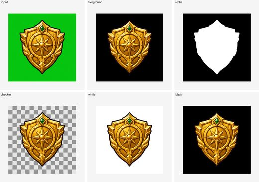</a> <b>I001</b> · ok pymatting-hard-button pymatting_known_b</td>
<td width="33%" valign="top"><a href="#i002" title="I002 · icon · pymatting-hard-button">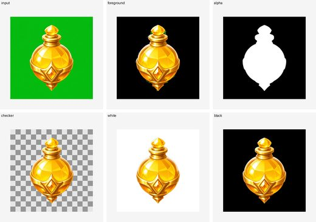</a> <b>I002</b> · ok pymatting-hard-button pymatting_known_b</td>
<td width="33%" valign="top"><a href="#i003" title="I003 · icon · pymatting-hard-button">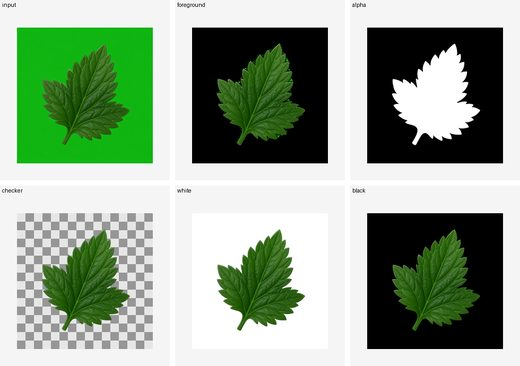</a> <b>I003</b> · ok pymatting-hard-button pymatting_known_b</td>
</tr>
<tr>
<td width="33%" valign="top"><a href="#i004" title="I004 · icon · pymatting-hard-button">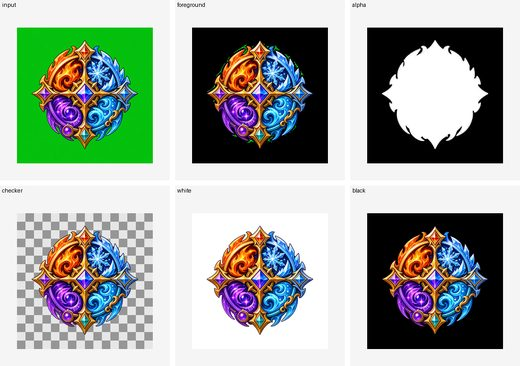</a> <b>I004</b> · ok pymatting-hard-button pymatting_known_b</td>
<td width="33%" valign="top"><a href="#i005" title="I005 · icon · pymatting-hard-button">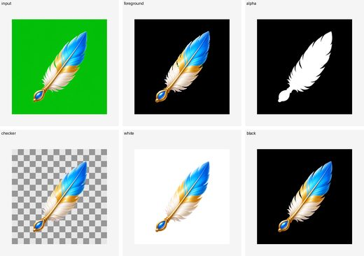</a> <b>I005</b> · ok pymatting-hard-button pymatting_known_b</td>
<td width="33%" valign="top"><a href="#i006" title="I006 · icon · corridorkey-shaped-icon">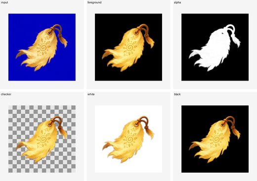</a> <b>I006</b> · ok corridorkey-shaped-icon corridorkey</td>
</tr>
<tr>
<td width="33%" valign="top"><a href="#i007" title="I007 · icon · corridorkey-shaped-icon">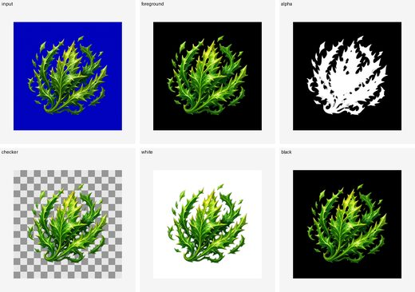</a> <b>I007</b> · ok corridorkey-shaped-icon corridorkey</td>
<td width="33%" valign="top"><a href="#i008" title="I008 · icon · pymatting-hard-button">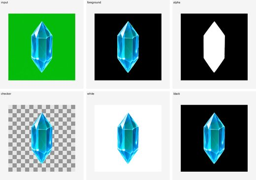</a> <b>I008</b> · ok pymatting-hard-button pymatting_known_b</td>
<td width="33%" valign="top"> <b>I009</b> · ok pymatting-hard-button pymatting_known_b</td>
</tr>
<tr>
<td width="33%" valign="top"> <b>I010</b> · ok corridorkey-character corridorkey</td>
<td width="33%" valign="top"> <b>I011</b> · ok known-bg-glow known_bg_glow</td>
<td width="33%" valign="top"> <b>I012</b> · ok corridorkey-character corridorkey</td>
</tr>
<tr>
<td width="33%" valign="top"> <b>I013</b> · ok corridorkey-character corridorkey</td>
<td width="33%" valign="top"> <b>I014</b> · ok corridorkey-character corridorkey</td>
<td width="33%" valign="top"> <b>I015</b> · ok corridorkey-character corridorkey</td>
</tr>
<tr>
<td width="33%" valign="top"> <b>I016</b> · ok corridorkey-character corridorkey</td>
<td width="33%" valign="top"> <b>I017</b> · ok corridorkey-character corridorkey</td>
<td width="33%" valign="top"> <b>I018</b> · ok known-bg-glow known_bg_glow</td>
</tr>
<tr>
<td width="33%" valign="top"> <b>I019</b> · ok known-bg-glow known_bg_glow</td>
<td width="33%" valign="top"> <b>I020</b> · ok known-bg-glow known_bg_glow</td>
<td width="33%" valign="top"> <b>I021</b> · ok corridorkey-character corridorkey</td>
</tr>
<tr>
<td width="33%" valign="top"> <b>I022</b> · ok pymatting-known-bg pymatting_known_b</td>
</tr>
</table>

### I001

- Case: `I001_icon_icon_a01_hard_boundary_strong_outline_green`
- Status: `ok`
- Profile: `pymatting-hard-button`
- Algorithm: `pymatting_known_b`
- Execution backend: `direct-pymatting-known-b`
- Input: `samples/corridorkey_semantic/icon/icon_icon_a01_hard_boundary_strong_outline/green.png`
- Manifest: `out/direct_worker_game_input_20260610_v002/I001_icon_icon_a01_hard_boundary_strong_outline_green/manifest.json`

### I002

- Case: `I002_icon_icon_a02_hard_boundary_unoutlined_green`
- Status: `ok`
- Profile: `pymatting-hard-button`
- Algorithm: `pymatting_known_b`
- Execution backend: `direct-pymatting-known-b`
- Input: `samples/corridorkey_semantic/icon/icon_icon_a02_hard_boundary_unoutlined/green.png`
- Manifest: `out/direct_worker_game_input_20260610_v002/I002_icon_icon_a02_hard_boundary_unoutlined_green/manifest.json`

### I003

- Case: `I003_icon_icon_a03_hard_boundary_weak_contrast_green`
- Status: `ok`
- Profile: `pymatting-hard-button`
- Algorithm: `pymatting_known_b`
- Execution backend: `direct-pymatting-known-b`
- Input: `samples/corridorkey_semantic/icon/icon_icon_a03_hard_boundary_weak_contrast/green.png`
- Manifest: `out/direct_worker_game_input_20260610_v002/I003_icon_icon_a03_hard_boundary_weak_contrast_green/manifest.json`

### I004

- Case: `I004_icon_icon_a04_hard_boundary_complex_interior_green`
- Status: `ok`
- Profile: `pymatting-hard-button`
- Algorithm: `pymatting_known_b`
- Execution backend: `direct-pymatting-known-b`
- Input: `samples/corridorkey_semantic/icon/icon_icon_a04_hard_boundary_complex_interior/green.png`
- Manifest: `out/direct_worker_game_input_20260610_v002/I004_icon_icon_a04_hard_boundary_complex_interior_green/manifest.json`

### I005

- Case: `I005_icon_icon_b01_soft_boundary_antialias_green`
- Status: `ok`
- Profile: `pymatting-hard-button`
- Algorithm: `pymatting_known_b`
- Execution backend: `direct-pymatting-known-b`
- Input: `samples/corridorkey_semantic/icon/icon_icon_b01_soft_boundary_antialias/green.png`
- Manifest: `out/direct_worker_game_input_20260610_v002/I005_icon_icon_b01_soft_boundary_antialias_green/manifest.json`

### I006

- Case: `I006_icon_icon_b02_soft_boundary_feathered_blue`
- Status: `ok`
- Profile: `corridorkey-shaped-icon`
- Algorithm: `corridorkey`
- Execution backend: `direct-corridorkey`
- Input: `samples/corridorkey_semantic/icon/icon_icon_b02_soft_boundary_feathered/blue.png`
- Manifest: `out/direct_worker_game_input_20260610_v002/I006_icon_icon_b02_soft_boundary_feathered_blue/manifest.json`

### I007

- Case: `I007_icon_icon_b03_soft_boundary_fragmented_edge_blue`
- Status: `ok`
- Profile: `corridorkey-shaped-icon`
- Algorithm: `corridorkey`
- Execution backend: `direct-corridorkey`
- Input: `samples/corridorkey_semantic/icon/icon_icon_b03_soft_boundary_fragmented_edge/blue.png`
- Manifest: `out/direct_worker_game_input_20260610_v002/I007_icon_icon_b03_soft_boundary_fragmented_edge_blue/manifest.json`

### I008

- Case: `I008_icon_icon_c01_translucent_glass_crystal_green`
- Status: `ok`
- Profile: `pymatting-hard-button`
- Algorithm: `pymatting_known_b`
- Execution backend: `direct-pymatting-known-b`
- Input: `samples/corridorkey_semantic/icon/icon_icon_c01_translucent_glass_crystal/green.png`
- Manifest: `out/direct_worker_game_input_20260610_v002/I008_icon_icon_c01_translucent_glass_crystal_green/manifest.json`

### I009

- Case: `I009_icon_icon_c02_translucent_potion_bottle_green`
- Status: `ok`
- Profile: `pymatting-hard-button`
- Algorithm: `pymatting_known_b`
- Execution backend: `direct-pymatting-known-b`
- Input: `samples/corridorkey_semantic/icon/icon_icon_c02_translucent_potion_bottle/green.png`
- Manifest: `out/direct_worker_game_input_20260610_v002/I009_icon_icon_c02_translucent_potion_bottle_green/manifest.json`

### I010

- Case: `I010_icon_icon_c03_translucent_same_screen_tint_green`
- Status: `ok`
- Profile: `corridorkey-character`
- Algorithm: `corridorkey`
- Execution backend: `direct-corridorkey`
- Input: `samples/corridorkey_semantic/icon/icon_icon_c03_translucent_same_screen_tint/green.png`
- Manifest: `out/direct_worker_game_input_20260610_v002/I010_icon_icon_c03_translucent_same_screen_tint_green/manifest.json`

### I011

- Case: `I011_icon_icon_d01_soft_alpha_glow_hard_core_green`
- Status: `ok`
- Profile: `known-bg-glow`
- Algorithm: `known_bg_glow`
- Execution backend: `direct-known-bg-glow`
- Input: `samples/corridorkey_semantic/icon/icon_icon_d01_soft_alpha_glow_hard_core/green.png`
- Manifest: `out/direct_worker_game_input_20260610_v002/I011_icon_icon_d01_soft_alpha_glow_hard_core_green/manifest.json`

### I012

- Case: `I012_icon_icon_d02_soft_alpha_particle_mist_green`
- Status: `ok`
- Profile: `corridorkey-character`
- Algorithm: `corridorkey`
- Execution backend: `direct-corridorkey`
- Input: `samples/corridorkey_semantic/icon/icon_icon_d02_soft_alpha_particle_mist/green.png`
- Manifest: `out/direct_worker_game_input_20260610_v002/I012_icon_icon_d02_soft_alpha_particle_mist_green/manifest.json`

### I013

- Case: `I013_icon_icon_d03_soft_alpha_particle_fire_orange_blue`
- Status: `ok`
- Profile: `corridorkey-character`
- Algorithm: `corridorkey`
- Execution backend: `direct-corridorkey`
- Input: `samples/corridorkey_semantic/icon/icon_icon_d03_soft_alpha_particle_fire_orange/blue.png`
- Manifest: `out/direct_worker_game_input_20260610_v002/I013_icon_icon_d03_soft_alpha_particle_fire_orange_blue/manifest.json`

### I014

- Case: `I014_icon_icon_d04_soft_alpha_particle_poison_green_blue`
- Status: `ok`
- Profile: `corridorkey-character`
- Algorithm: `corridorkey`
- Execution backend: `direct-corridorkey`
- Input: `samples/corridorkey_semantic/icon/icon_icon_d04_soft_alpha_particle_poison_green/blue.png`
- Manifest: `out/direct_worker_game_input_20260610_v002/I014_icon_icon_d04_soft_alpha_particle_poison_green_blue/manifest.json`

### I015

- Case: `I015_icon_icon_d05_soft_alpha_particle_arcane_purple_green`
- Status: `ok`
- Profile: `corridorkey-character`
- Algorithm: `corridorkey`
- Execution backend: `direct-corridorkey`
- Input: `samples/corridorkey_semantic/icon/icon_icon_d05_soft_alpha_particle_arcane_purple/green.png`
- Manifest: `out/direct_worker_game_input_20260610_v002/I015_icon_icon_d05_soft_alpha_particle_arcane_purple_green/manifest.json`

### I016

- Case: `I016_icon_icon_d06_soft_alpha_particle_golden_stardust_green`
- Status: `ok`
- Profile: `corridorkey-character`
- Algorithm: `corridorkey`
- Execution backend: `direct-corridorkey`
- Input: `samples/corridorkey_semantic/icon/icon_icon_d06_soft_alpha_particle_golden_stardust/green.png`
- Manifest: `out/direct_worker_game_input_20260610_v002/I016_icon_icon_d06_soft_alpha_particle_golden_stardust_green/manifest.json`

### I017

- Case: `I017_icon_icon_d07_soft_alpha_particle_ice_white_blue_green`
- Status: `ok`
- Profile: `corridorkey-character`
- Algorithm: `corridorkey`
- Execution backend: `direct-corridorkey`
- Input: `samples/corridorkey_semantic/icon/icon_icon_d07_soft_alpha_particle_ice_white_blue/green.png`
- Manifest: `out/direct_worker_game_input_20260610_v002/I017_icon_icon_d07_soft_alpha_particle_ice_white_blue_green/manifest.json`

### I018

- Case: `I018_icon_icon_d08_soft_alpha_smooth_glow_green`
- Status: `ok`
- Profile: `known-bg-glow`
- Algorithm: `known_bg_glow`
- Execution backend: `direct-known-bg-glow`
- Input: `samples/corridorkey_semantic/icon/icon_icon_d08_soft_alpha_smooth_glow/green.png`
- Manifest: `out/direct_worker_game_input_20260610_v002/I018_icon_icon_d08_soft_alpha_smooth_glow_green/manifest.json`

### I019

- Case: `I019_icon_icon_d09_soft_alpha_smooth_white_glow_green_green`
- Status: `ok`
- Profile: `known-bg-glow`
- Algorithm: `known_bg_glow`
- Execution backend: `direct-known-bg-glow`
- Input: `samples/corridorkey_semantic/icon/icon_icon_d09_soft_alpha_smooth_white_glow_green/green.png`
- Manifest: `out/direct_worker_game_input_20260610_v002/I019_icon_icon_d09_soft_alpha_smooth_white_glow_green_green/manifest.json`

### I020

- Case: `I020_icon_icon_d10_soft_alpha_smooth_white_glow_blue_blue`
- Status: `ok`
- Profile: `known-bg-glow`
- Algorithm: `known_bg_glow`
- Execution backend: `direct-known-bg-glow`
- Input: `samples/corridorkey_semantic/icon/icon_icon_d10_soft_alpha_smooth_white_glow_blue/blue.png`
- Manifest: `out/direct_worker_game_input_20260610_v002/I020_icon_icon_d10_soft_alpha_smooth_white_glow_blue_blue/manifest.json`

### I021

- Case: `I021_icon_icon_d11_glass_portal_blue_blue`
- Status: `ok`
- Profile: `corridorkey-character`
- Algorithm: `corridorkey`
- Execution backend: `direct-corridorkey`
- Input: `samples/corridorkey_semantic/icon/icon_icon_d11_glass_portal_blue/blue.png`
- Manifest: `out/direct_worker_game_input_20260610_v002/I021_icon_icon_d11_glass_portal_blue_blue/manifest.json`

### I022

- Case: `I022_icon_neutral_cartoon_fox_violin_neutral`
- Status: `ok`
- Profile: `pymatting-known-bg`
- Algorithm: `pymatting_known_b`
- Execution backend: `direct-pymatting-known-b`
- Input: `samples/corridorkey_semantic/icon/icon_neutral_cartoon_fox_violin/neutral.png`
- Manifest: `out/direct_worker_game_input_20260610_v002/I022_icon_neutral_cartoon_fox_violin_neutral/manifest.json`

## Character (9)

<table>
<tr>
<td width="33%" valign="top"> <b>C001</b> · ok corridorkey-character corridorkey</td>
<td width="33%" valign="top"> <b>C002</b> · ok corridorkey-character corridorkey</td>
<td width="33%" valign="top"> <b>C003</b> · ok corridorkey-character corridorkey</td>
</tr>
<tr>
<td width="33%" valign="top"> <b>C004</b> · ok corridorkey-character corridorkey</td>
<td width="33%" valign="top"> <b>C005</b> · ok corridorkey-character corridorkey</td>
<td width="33%" valign="top"> <b>C006</b> · ok corridorkey-character corridorkey</td>
</tr>
<tr>
<td width="33%" valign="top"> <b>C007</b> · ok corridorkey-character corridorkey</td>
<td width="33%" valign="top"> <b>C008</b> · ok corridorkey-character corridorkey</td>
<td width="33%" valign="top"> <b>C009</b> · ok corridorkey-character corridorkey</td>
</tr>
</table>

### C001

- Case: `C001_character_char_a01_hair_hard_edge_glass_pendant_green_green`
- Status: `ok`
- Profile: `corridorkey-character`
- Algorithm: `corridorkey`
- Execution backend: `direct-corridorkey`
- Input: `samples/corridorkey_semantic/character/character_char_a01_hair_hard_edge_glass_pendant_green/green.png`
- Manifest: `out/direct_worker_game_input_20260610_v002/C001_character_char_a01_hair_hard_edge_glass_pendant_green_green/manifest.json`

### C002

- Case: `C002_character_char_a02_hair_armor_glass_visor_blue_blue`
- Status: `ok`
- Profile: `corridorkey-character`
- Algorithm: `corridorkey`
- Execution backend: `direct-corridorkey`
- Input: `samples/corridorkey_semantic/character/character_char_a02_hair_armor_glass_visor_blue/blue.png`
- Manifest: `out/direct_worker_game_input_20260610_v002/C002_character_char_a02_hair_armor_glass_visor_blue_blue/manifest.json`

### C003

- Case: `C003_character_char_a03_hair_fur_hard_blade_translucent_scarf_green_green`
- Status: `ok`
- Profile: `corridorkey-character`
- Algorithm: `corridorkey`
- Execution backend: `direct-corridorkey`
- Input: `samples/corridorkey_semantic/character/character_char_a03_hair_fur_hard_blade_translucent_scarf_green/green.png`
- Manifest: `out/direct_worker_game_input_20260610_v002/C003_character_char_a03_hair_fur_hard_blade_translucent_scarf_green_green/manifest.json`

### C004

- Case: `C004_character_char_a04_hair_transparent_wings_soft_glow_blue_blue`
- Status: `ok`
- Profile: `corridorkey-character`
- Algorithm: `corridorkey`
- Execution backend: `direct-corridorkey`
- Input: `samples/corridorkey_semantic/character/character_char_a04_hair_transparent_wings_soft_glow_blue/blue.png`
- Manifest: `out/direct_worker_game_input_20260610_v002/C004_character_char_a04_hair_transparent_wings_soft_glow_blue_blue/manifest.json`

### C005

- Case: `C005_character_char_a05_hard_armor_hair_glass_shield_green_green`
- Status: `ok`
- Profile: `corridorkey-character`
- Algorithm: `corridorkey`
- Execution backend: `direct-corridorkey`
- Input: `samples/corridorkey_semantic/character/character_char_a05_hard_armor_hair_glass_shield_green/green.png`
- Manifest: `out/direct_worker_game_input_20260610_v002/C005_character_char_a05_hard_armor_hair_glass_shield_green_green/manifest.json`

### C006

- Case: `C006_character_char_a06_pale_hair_translucent_sleeves_white_glow_blue_blue`
- Status: `ok`
- Profile: `corridorkey-character`
- Algorithm: `corridorkey`
- Execution backend: `direct-corridorkey`
- Input: `samples/corridorkey_semantic/character/character_char_a06_pale_hair_translucent_sleeves_white_glow_blue/blue.png`
- Manifest: `out/direct_worker_game_input_20260610_v002/C006_character_char_a06_pale_hair_translucent_sleeves_white_glow_blue_blue/manifest.json`

### C007

- Case: `C007_character_char_a07_fur_hair_hard_bow_translucent_cloak_green_green`
- Status: `ok`
- Profile: `corridorkey-character`
- Algorithm: `corridorkey`
- Execution backend: `direct-corridorkey`
- Input: `samples/corridorkey_semantic/character/character_char_a07_fur_hair_hard_bow_translucent_cloak_green/green.png`
- Manifest: `out/direct_worker_game_input_20260610_v002/C007_character_char_a07_fur_hair_hard_bow_translucent_cloak_green_green/manifest.json`

### C008

- Case: `C008_character_char_a08_spiky_hair_hard_mech_translucent_raincoat_blue_blue`
- Status: `ok`
- Profile: `corridorkey-character`
- Algorithm: `corridorkey`
- Execution backend: `direct-corridorkey`
- Input: `samples/corridorkey_semantic/character/character_char_a08_spiky_hair_hard_mech_translucent_raincoat_blue/blue.png`
- Manifest: `out/direct_worker_game_input_20260610_v002/C008_character_char_a08_spiky_hair_hard_mech_translucent_raincoat_blue_blue/manifest.json`

### C009

- Case: `C009_character_char_a09_hair_hard_costume_translucent_silk_ribbons_green_green`
- Status: `ok`
- Profile: `corridorkey-character`
- Algorithm: `corridorkey`
- Execution backend: `direct-corridorkey`
- Input: `samples/corridorkey_semantic/character/character_char_a09_hair_hard_costume_translucent_silk_ribbons_green/green.png`
- Manifest: `out/direct_worker_game_input_20260610_v002/C009_character_char_a09_hair_hard_costume_translucent_silk_ribbons_green_green/manifest.json`
